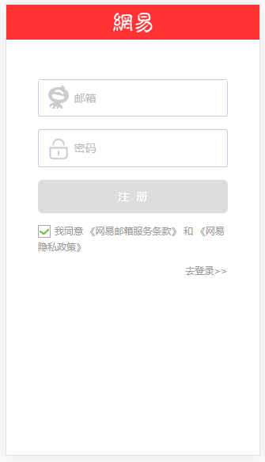

## NUXT(服务器端渲染)实战：模仿手机网易网
前后端通过JSON进行通信，后台restful api采用node + koa框架。[项目地址](https://github.com/handsomeJs/news-wy-server)
<br>
关于为什么要使用服务器端渲染。主要的原因有以下两点
<br>
1、在渲染页面数据时不需要客户端发起ajax请求数据然后将数据插入到页面，而是直接在服务器完成请求数据的逻辑，直接返回插入好数据的html给客户端渲染，因此有更快的内容到达时间(time-to-content)。
<br>
2、便于SEO，如果是单页面应用不使用服务端渲染的话在页面结构看到的只是空荡荡的div #app

## 技术栈
Vue + Vuex + (NUXT)SSR

## 记录用户的登录状态
我们这里用Vuex和localStorage来存储用户的登录状态，同时使用vuex-persistedstate插件，将Vuex的数据持久化为cookie，方便我们对数据的操作。
为什么要这么做，主要是出于以下原因：
<br>
1、数据存在vuex里面，网页一刷新vuex里面的数据就清空了，就意味着要重新登录。
<br>
2、存储在localStorage的数据虽然可以长期保留（页面刷新后还在），但是localStorage只能存储字符串形式的数据，而我在Vuex中的数据是以对象的形式存储的。
<br>
关于vuex-persistedstate的文档请查看[这里](https://github.com/robinvdvleuten/vuex-persistedstate)

## 关于Window对象
在服务器端渲染的过程中是无法使用Window对象的，所以如果我们要使用Window对象，需要在mounted或mouted以后去使用。

## OpenBrowserPlugin
因为用nuxt提供的脚手架生成的项目不支持当启动项目的时候自动打开浏览器，所以本人就引入了OpenBrowserPlugin的webpack插件。具体的配置在nuxt.config.js文件中。

## 页面预览

### 首页与首页登录
 

### 推荐与原创页
 

### 登录与注册页
 

## 项目运行
``` bash
# install dependencies
$ npm install

# serve with hot reload at localhost:3000
$ npm run dev

# build for production and launch server
$ npm run build
$ npm start

# generate static project
$ npm run generate
```
